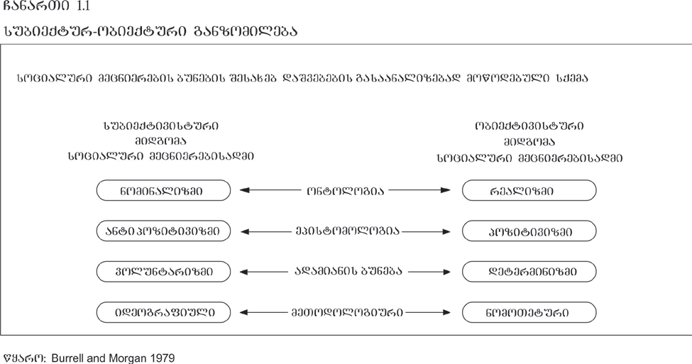
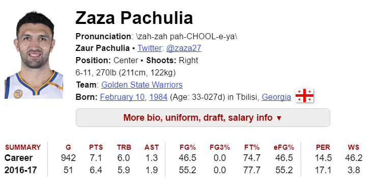

სმკმ: პირველი შეხვედრა

სოციალურ მეცნიერებათა კვლევის მეთოდები
========================================================
author: დავით სიჭინავა
date: ოდესმე, მარტის შუა რიცხვებში...
autosize: true
transition: none
css: css/style.css
font-family: 'BPG_upper'
პირველი შეხვედრა

დღევანდელი შეხვედრის გეგმა
========================================================
incremental: true

- კურსის გაცნობა და ლოგისტიკა
  - შეფასება, დავალებები, შუალედური და საბოლოო გამოცდები...
- ლექცია: კვლევის მნიშვნელობა სოციალურ მეცნიერებებში

რას გავიგებ ამ კურსის ფარგლებში?
========================================================
incremental: true

- რატომ გვჭირდება კვლევა;
- რა არის კვლევის პარადიგმები;
- კვლევის კონკრეტული მეთოდები, განსხვავება, უპირატესობა;
- კვლევის ეთიკური მხარე

კურსის ვებსაიტი:
========================================================
incremental: false

e-learning.tsu.ge

კურსის სტრუქტურა: 
========================================================
incremental: false

  ლექცია
 

კურსის სტრუქტურა: 
========================================================
incremental: false

  ლექცია
 
 სემინარი

კურსის სტრუქტურა: 
========================================================
incremental: false

- თ. ზურაბიშვილი. თვისებრივი მეთოდები სოციალურ კვლევაში, თბილისი, 2004. 
- დურგლიშვილი, ნინო. სოციოლოგიურ მონაცემთა ანალიზი, თბილისი. 2006
- წულაძე, ლია. რაოდენობრივი კვლევის მეთოდები სოციალურ მეცნიერებებში. 2008
- თამარ ზურაბიშვილი, თინათინ ზურაბიშვილი. სოციოლოგიური კვლევის მეთოდიკა. რაოდენობრივი მეთოდები.
- ნინო ჯავახიშვილი, ფსიქოლოგიის კვლევის მეთოდები.
- უვე ფლიკი. 2009. თვისებრივი კვლევის შესავალი. სეიჯი (ქართული თარგმანი) 
- ალან ბრაიმანი. 2012. სოციალური კვლევის მეთოდები. ოქსფორდი, მეოთხე გამოცემა

	
შეფასება: 
========================================================
incremental: false

 
[ფოტოს წყარო](https://www.facebook.com/Maghlive/photos/a.212470299086939.1073741827.212465039087465/404816289852338/?type=1&theater)

შეფასების კომპონენტები: 
========================================================
incremental: false

- (სემინარზე ვერბალური სახით) აქტიურობა (15%)
	+ სამი ესსე (5-5%)
- წერითი დავალებები (25%)
	+ ლიტერატურის მიმოხილვა (3%)
	+ სიღრმისეული ინტერვიუს სადისკუსიო გეგმის შედგენა (3%)
	+ ფოკუსჯგუფის სადისკუსიო გეგმის შედგენა (3%)
	+ დაკვირვება (3%)
	+ კვლევის დიზაინი (7%)
	+ კითხვარის/ანკეტის შედგენა (6%)
- შუალედური  გამოცდა (25%)
- საბოლოო გამოცდა (30%)
- 🤔 დასწრება (5%)

რატომ გვჭირდება კვლევა?
====================================

> In God we trust. Others bring data

> ღმერთის გვწამს. სხვებმა კი მონაცემები წარმოადგინონ (ედვარდს დემინგი)

რატომ გვჭირდება კვლევა?
====================================
ქაღალდზე დაწერეთ თქვენი ტელეფონის ნომრის ბოლო ორი ციფრი

რატომ გვჭირდება კვლევა?
====================================

რატომ გვჭირდება კვლევა?
====================================

რატომ გვჭირდება კვლევა?
====================================

ცოდნის მოდელები
====================================

* ავტორიტეტული
* მისტიკური
* რაციონალისტური

ცოდნის წყაროები
====================================

* პერსონალური გამოცდილება
* ,,საყოველთაოდ მიღებული ჭეშმარიტება''
* ექსპერტები და ავტორიტეტები
* მედია
* იდეოლოგიური რწმენები და ღირებულებები

მეცნიერების საბაზისო დაშვებები
====================================

* ბუნება მოწესრიგებულია
* ბუნების არსში ჩაწვდომა შესაძლებელია
* ყველაფერს _ბუნებრივი_ საფუძველი გააჩნია
* ყველაფერი დამტკიცებას მოითხოვს
* ცოდნა ემპირიულ დაკვირვებას ეყრდნობა
* ,,არცოდნა ცოდვაა''

კარლ პოპერის გედები
====================================

თომას ქუნი და პარადიგმის ჩანაცვლება
====================================

ორი უცხო სიტყვა
====================================
incremental: true

> ონტოლოგია: ფილოსოფიური მოძღვრება ყოფიერების, საგნების არსის შესახებ

> ეპისტემოლოგია: ფილოსოფიური სწავლება ცოდნის და შემეცნების ბუნების შესახებ

სოციალური კვლევის ბუნება
====================================

მეცნიერული ახსნის ფორმები
====================================
* იდიოგრაფია: __ერთი__ კონკრეტული შემთხვევის, ფენომენის გამომწვევი მიზეზების _ამომწურავი_ დახასიათება

* ნომოთეტია: ფენომენის გამომწვევი _ზოგადი_ მიზეზების დახასიათება

მეცნიერული ახსნა
====================================

* დედუქცია
	+ უნივერსალური განზოგადება
	+ პირობები, რომელშიც განზოგადება ჭეშმარიტია
	+ მოვლენის ახსნა
	+ ფორმალური ლოგიკის წესების დაცვა

მეცნიერული ახსნა
====================================

* ალბათური ახსნა (ინდუქცია)
	+ გამომდინარეობს _ალბათური_ განზოგადებიდან და მიგვითითებს _ტენდენციაზე_
	+ დასკვნა _სრული დარწმუნებით_ არ გამოგვაქვს

ალბათური ახსნა (ინდუქცია)
====================================
left: 30%

****
<!-- *** -->

მეცნიერული ახსნა
====================================

პროგნოზი
====================================
incremental: true
left: 0%

თუ $X → Y$ და არსებობს $X$, მაშინ $Y$-ის გამოჩენა სავარაუდოა

გაგება
====================================
* ინტერპრეტაცია

* _პრედიქტული_ გაგება

მეთოდოლოგია და მეთოდი
====================================

მეთოდოლოგია
====================================
incremental: true

წესებისა და პროცედურების სისტემა, რომელსაც კვლევა ემყარება

უზრუნველყოფს _კომუნიკაციას_, ანუ ვუხსნით სხვა მკვლევრებს, თუ როგორ განხორციელდა კვლევა (რეპლიკაცია / განმეორება)

მეთოდოლოგია
====================================

სოციალურ მეცნიერებათა პარადიგმები
====================================

> პარადიგმა: იდეათა და შეხედულებათა ერთობლიობა

სოციალურ მეცნიერებათა პარადიგმები
====================================

მაგალითად:

* ადრეული პოზიტივიზმი

* სოციალური დარვინიზმი

* ფემინიზმი

* პოსტკოლონიალიზმი

* კრიტიკული თეორია

====================================

