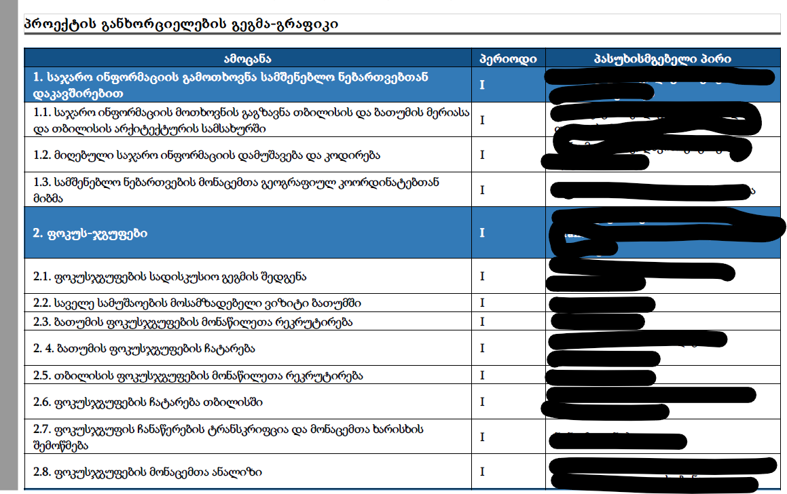
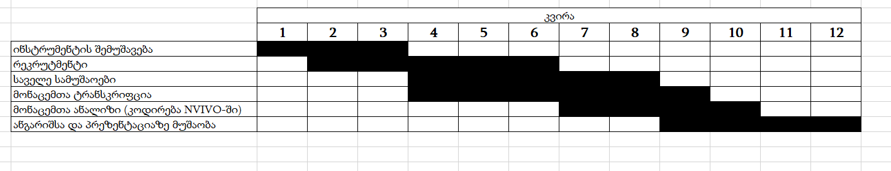

სმკმ: მეცამეტე შეხვედრა

სოციალურ მეცნიერებათა კვლევის მეთოდები
========================================================
author: დავით სიჭინავა
date: 28 მაისი, 2020 წ.
autosize: true
transition: none
css: css/style.css
font-family: 'BPG_upper'
მეცამეტე შეხვედრა

დღევანდელი შეხვედრის გეგმა
========================================================
- კვლევის საპროექტო განაცხადი
- მაგიური APA სტილი
- კვლევის ანგარიში

კვლევის საპროექტო განაცხადი
========================================================
+ თანამედროვე პირობებში, ნებისმიერი კვლევითი პროექტი იწყება შესაბამისი ფინანსების მოძიებით
+ დაფინანსების წყაროები:
	- უნივერსიტეტი და ფაკულტეტი
	- სხვადასხვა კვლევითი ფონდები
	- საერთაშორისო ორგანიზაციები
	- კერძო ფირმები

კვლევის საპროექტო განაცხადი
========================================================
+ ნებისმიერ შემთხვევაში, თქვენ (დამკვეთს/გრანტის გამცემს/კლიენტს/უფროსობას) უნდა დაუსაბუთოთ, თუ რატომ არის ამა თუ იმ საკითხის შესწავლა მნიშვნელოვანი
+ სტილი იცვლება იმის მიხედვით, ვმუშაობთ კომერციულ კლიენტთან, აკადემიურ კონტექსტში თუ პროექტის შეფასების კუთხით
+ თუმცა განაცხადის ძირითადი სქემა ერთი და იგივეა

საპროექტო განაცხადის სტრუქტურა
========================================================
+ სათაური
+ რეზიუმე (აბსტრაქტი)
+ კონტექსტუალიზაცია
+ კვლევის კითხვები და ამოცანები
+ მეთოდები
+ თეორიული მიმოხილვა
+ კვლევის გეგმა-გრაფიკი
+ ბიბლიოგრაფია

სათაური
========================================================
+ ეცადეთ, კვლევის შინაარსი მარტივად მაგრამ ამომწურავად შეაჯამოთ
+ შესაძლოა, გქონდეთ ქვესათაურიც

სათაური
========================================================
+ „ფართომასშტაბიანი, კერძო სექტორის მიერ განხორციელებული ურბანული განვითარების პროექტების სოციალური ზეგავლენა ბათუმსა და თბილისზე“
+ „სოციალური მოძრაობები თანამედროვე საქართველოში“
+ „სოციალური შეჭიდულობის ძიება საქართველოს მცირე ურბანულ დასახლებებში“

რეზიუმე (აბსტრაქტი)
========================================================
+ რეზიუმე თქვენი კვლევის მოკლე შინაარსია
+ ეცადეთ, თავიდან აირიდოთ „შემავსებელი სიტყვები“
+ სტრუქტურა:
	- პირველ წინადადებაში მოკლედ ვაჯამებთ, რას ვიკვლევთ,
	- მომდევნო წინადადებებში ვახასიათებთ ზოგად კონტექსტს - რატომ არის მნიშვნელოვანი ეს კონკრეტული თემა, რა უნდა იცოდეს მკითხველმა და ა.შ.
	- შემდეგ ვწერთ, რა სიახლეს ვთავაზობთ მკითხველს და რა სოციალურ თეორიას (თუ ეს საჭიროა) ვუკავშირებთ ჩვენს თემას
	- მომდევნო წინადადებაში აღიწერება კვლევის მეთოდოლოგია
	- ბოლოს - ვსაუბრობთ პრაქტიკულ შედეგებზე (თუ ეს საჭირო გახდა)

კონტექსტუალიზაცია
========================================================
+ კონტექსტუალიზაცია (ან - შესავალი) წარმოადგენს აბსტრაქტის გავრცობილ ვერსიას
+ აქ თქვენ ასევე ახასიათებთ, თუ რატომ არის თქვენი კვლევა აქტუალური

კვლევის კითხვები და ამოცანები
========================================================
+ კვლევითი კითხვა არ არის შეკითხვა კითხვარიდან
+ მან მოკლედ უნდა შეაფასოს ის კონკრეტული თემა, რასაც თქვენ გამოიკვლევთ
+ შესაძლებელია, კვლევის ამოცანების პუნქტების ფორმით ჩამოწერა

კვლევის კითხვები და ამოცანები
========================================================
_პრობლემის ფორმულირება: ზემოთქმულიდან გამომდინარე, ჩვენი საპროექტო განაცხადი შეეხება ოთხ ძირითად კითხვას:_
- პირველი, აღწერითი ხასიათის კითხვაში ვპასუხობთ, თუ რა არის მსხვილი, კერძო ურბანული განვითარების პროექტების მასშტაბები თბილისსა და ბათუმში და როგორია მსგავსი ტიპის შენობების დასრულების და ვაკანტურობის მაჩვენებლები?
- მეორე, უფრო ანალიტიკური ხასიათის კითხვაში ვპასუხობთ, თუ რა წარმოადგენს მსგავსი ტიპის პროექტების სოციალურ გავლენას უბნებსა და მცხოვრებლებზე.
- მესამე, თეორიული თვალსაზრისით, დაინტერესებული ვართ, გავიგოთ, თუ რა არის ფართომასშტაბიანი კერძო სექტორის მიერ განხორციელებული განვითარების პროექტები გლობალური საბაზრო ძალების, კაპიტალის აკუმულაციის და ქალაქების ბრენდინგის კუთხით.
- მეოთხე, საჯარო პოლიტიკასთან მიმართებაში, გვაინტერესებს, თუ როგორაა მოწყობილი ახალი გეგმარებითი რეგულაციები და კანონები, რათა მსხვილი ურბანული განვითარების პროექტების უარყოფითი სოციალური ზეგავლენა იყოს თავიდან აცილებული.

კვლევის კითხვები და ამოცანები
========================================================
- ამოცანა 1: გავზომოთ მსხვილმასშტაბიანი, კერძო სექტორის მიერ ინიცირებული ურბანული განვითარების მასშტაბები და შევაფასოთ შენობათა დასრულებისა და ვაკანტურობის მაჩვენებლები. ამისთვის ჩვენ დავეყრდნობით თბილისის და ბათუმის მერიებიდან გამოთხოვნილ საჯარო ინფორმაციას. ჩვენ ასევე შევიმუშავებთ და თბილისსა და ბათუმში ჩავატარებთ სამეზობლოების/ვაკანტური საცხოვრისის აღწერას. ეს ამოცანები შესრულდება პირველი და მესამე საანგარიშო პერიოდის განმავლობაში

- ამოცანა 2: შევიწავლოთ, თუ როგორი გავლენა აქვთ ამ პროექტებს მათ ირგვლივ მდებარე უბნებსა და ამ უკანაკსნელთა მცხოვრებლებზე. ამისთვის პირველი საანგარიშო პერიოდის შუაში ჩვენ ჩავატარებთ ხუთ-ხუთ ფოკუსჯგუფს თითოეულ ქალაქში. ამ მონაცემთა საფუძველზე, შემუშავებული იქნება მასობრივი გამოკითხვის ინსტრუმენტები. თავად გამოკითხვის საველე სამუშაოები პირველი წლის დასასრულს (ბათუმში) და მეორე წლის დასაწყისში (თბილისში) ჩატარდება. ამ ამოცანების შესასრულებლად, ჩვენ ასევე გამოვიყენებთ საველე დაკვირვებებს პირველი და მეორე საანგარიშო წლის მანძილზე.

კვლევის მეთოდოლოგია
========================================================
+ ამ სექციაში ვახასიათებთ ჩვენს მიერ გამოყენებულ მეთოდებს და ვასაბუთებთ ჩვენს მეთოდოლოგიურ არჩევანს

კვლევის მეთოდოლოგია
========================================================
- თითეულ ქალაქში ჩატარებული ხუთ-ხუთი ფოკუსჯგუფი საშუალებას მოგვცემს, გავიგოთ, თუ როგორ ინტეპრეტაციას უკეთებენ თბილისის და ბათუმის მცხოვრებლები მათ დასახლებებში მომხდარ ცვლილებებს, როგორი დამოკიდებულება აქვთ ადგილების ცვალებად მნიშვნელობასთან და ე.წ. ფლაგმანური არქიტექტურული მეგაპროექტების მიმართ, ასევე - როგორ არიან განწყობილნი ურბანულ განვითარებაში ჩადებული ინვესტიციების მიმართ

თეორიული მიმოხილვა
========================================================
იგივე - ლიტერატურის მიმოხილვა

კვლევის გეგმა-გრაფიკი
========================================================
- კვლევის ამოცანების მიხედვით შეგვიძლია, გავწეროთ შესასრულებელი სამუშაოები
- ეს კარგია პროექტის მართვისთვისაც
- შეგიძლიათ, გამოიყენოთ პროგრამები (Microsoft Project, Trello, Dropbox Paper, Google Keep)

კვლევის გეგმა-გრაფიკი
========================================================

ე.წ. განტ-ჩარტი
========================================================

ბიბლიოგრაფია
========================================================
+ გამოყენებული ლიტერატურის ჩამონათვალი

ბიბლიოგრაფიის სტილები
========================================================
+ APA
+ MLA
+ Chicago/Turabian
+ Harvard

APA
========================================================
+ ეს სტილი მოიცავს არამარტო ბიბლიოგრაფიის მომზადების წესებს, არამედ - არეგულირებს, თუ როგორ უნდა იყოს ტექსტი წარმოდგენილი
+ თუმცა ჩვენს შემთხვევაში, მხოლოდ ბიბლიოგრაფიის მითითებას განვიხილავთ
წყარო: https://pitt.libguides.com/c.php?g=12108&p=64730

APA: ბიბლიოგრაფია
========================================================
+ წიგნის თავი: Haybron, D. M. (2008). Philosophy and the science of subjective well-being. In M. Eid & R. J. Larsen (Eds.), _The science of subjective well-being (pp. 17-43)_. New York, NY: Guilford Press.

+ სტატია: Gaudio, J. L., & Snowdon, C. T. (2008). Spatial cues more salient than color cues in cotton-top tamarins (saguinus oedipus) reversal learning. _Journal of Comparative Psychology, 122,_ 441-444. doi: 10.1037/0735-7036.122.4.441

ჩიკაგოს სტილი
========================================================
- სქოლიო
- ტექსტური ციტირება

ჩიკაგო: წიგნი სქოლიოში
========================================================
სქოლიო:  1. Michael Pollan, _The Omnivore's Dilemma: A Natural History of Four Meals_ (New York: Penguin, 2006), 99–100.

განმეორება:  2. Pollan, Omnivore's Dilemma, 3. 

ბიბლიოგრაფია: Pollan, Michael. _The Omnivore's Dilemma: A Natural History of Four Meals._ New York: Penguin, 2006.

წყარო: https://pitt.libguides.com/c.php?g=12108&p=64732

ჩიკაგო: სტატია სქოლიოში
========================================================
სქოლიო: 1. Gueorgi Kossinets and Duncan J. Watts, “Origins of Homophily in an Evolving Social Network,” _American Journal of Sociology_ 115 (2009): 411, accessed February 28, 2010, doi:10.1086/599247.

განმეორება: Kossinets and Watts, “Origins of Homophily,” 439.

ბიბლიოგრაფია: Kossinets, Gueorgi, and Duncan J. Watts. “Origins of Homophily in an Evolving Social Network.” _American Journal of Sociology_ 115 (2009): 405–50. Accessed February 28, 2010. doi:10.1086/599247.

ჩიკაგო: ტექსტური ციტირება
========================================================
+ თარიღი, ავტორი, გვერდი, მაგ.
	- (Pollan 2006, 99–100)

მომდევნო ლექციისთვის:
========================================================
* მათ, ვისაც კომპიუტერთან გაქვთ წვდომა, გადმოწერეთ BlueSky Statistics ამ ბმულიდან:
	- https://www.blueskystatistics.com/Articles.asp?ID=301
	- დააყენეთ თქვენი კომპიუტერის შესაბამისი ვერსია
* შემდეგ ლექციაზე გავაკეთებთ რაოდენობრივ მონაცემთა მარტივ ანალიზს

