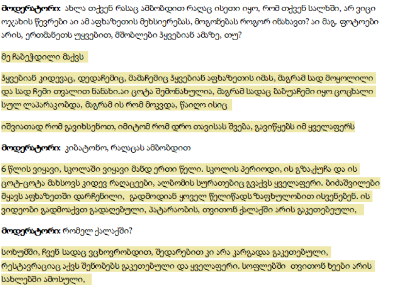
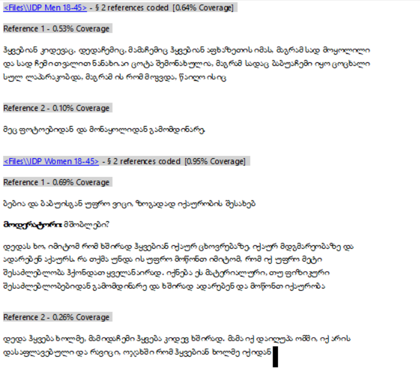
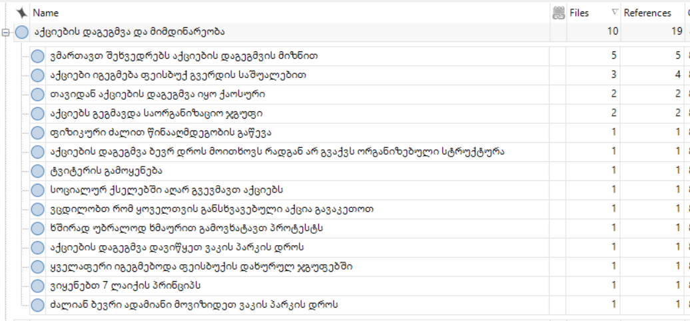
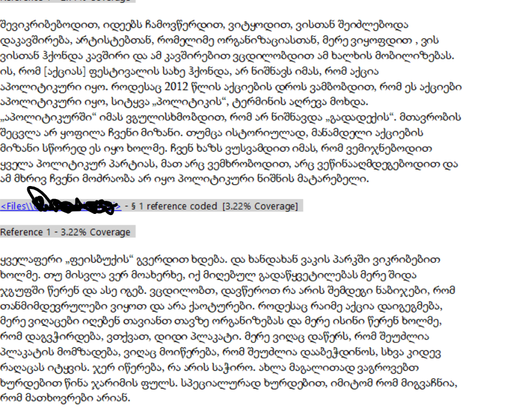
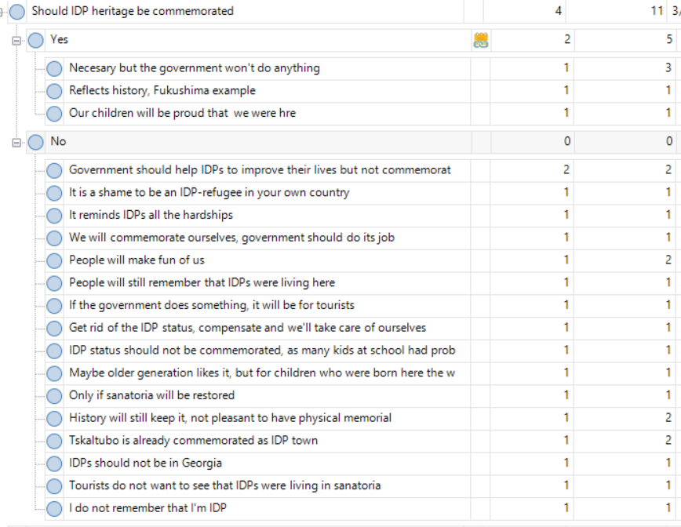
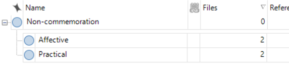
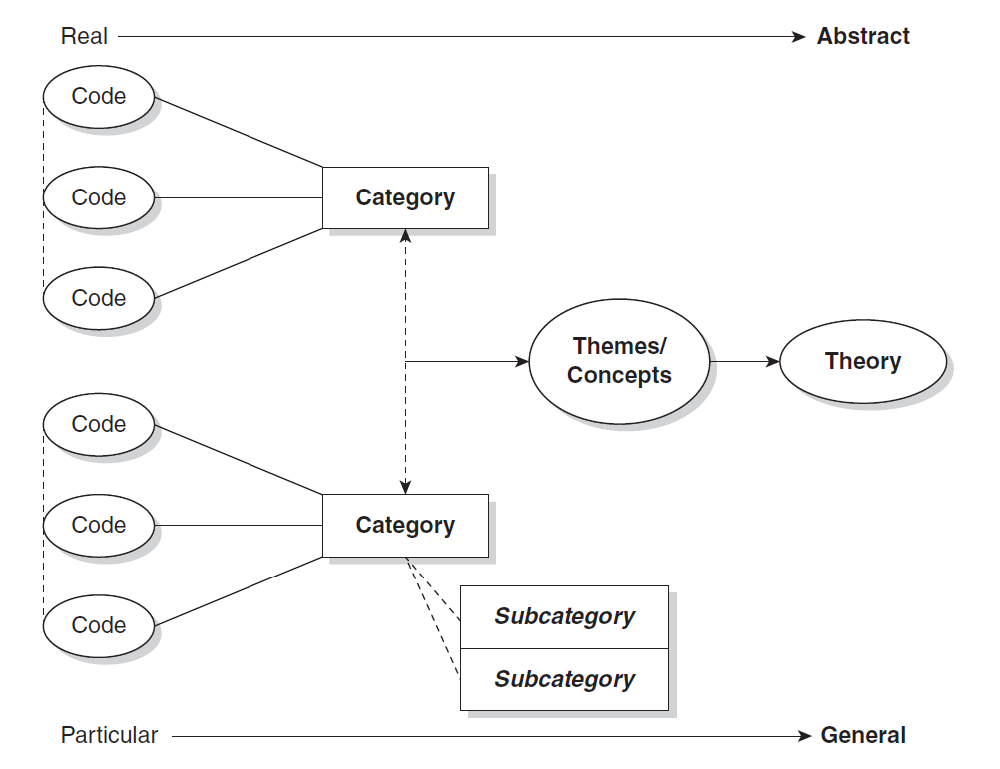

სმკმ: მეთხუთმეტე შეხვედრა

სოციალურ მეცნიერებათა კვლევის მეთოდები
========================================================
author: დავით სიჭინავა
date: 11 ივნისი, 2020 წ.
autosize: true
transition: none
css: css/style.css
font-family: 'BPG_upper'
მეთხუთმეტე შეხვედრა

დღევანდელი შეხვედრის გეგმა
========================================================

- ლექცია: თვისებრივ მონაცემთა დამუშავება და ანალიზი (ეფუძნება Saldana, J. "The Coding Manual for Qualitative Research")
- სემინარი: პრაქტიკული დავალებები

რა არის კოდი?
========================================================
კოდი თვისებრივ კვლევაში წარმოადგენს სიტყვას ან ფრაზას, რომელიც ვიზუალური ან ტექსტური მონაცემის შინაარს აჯამებს.

რა არის კოდი?
========================================================

რა არის კოდი?
========================================================

როგორ ინახავენ დევნილები აფხაზეთზე მეხსიერებას.

რა არის კოდი?
========================================================

_პირველი დონის კოდი: _ როგორ ინახავენ დევნილები აფხაზეთზე მეხსიერებას.

_მეორე დონის კოდი:_
+ ზეპირსიტყვიერად, მშობლების მეშვეობით
+ ფოტოალბომებით
+ ინტერნეტით

რას ვიგებთ კოდირებით?
========================================================
- ფენომენის მახასიათებლებს (Patterns)
	+ მსგავსება
	+ განსხვავება
	+ სიხშირე
	+ თანმიმდევრობა
	+ შესაბამისობა
	+ მიზეზშედეგობრიობა

რას ვიგებთ კოდირებით?
========================================================

რას ვიგებთ კოდირებით?
========================================================

კოდირება, როგორც ევრისტიკა
========================================================
+ არის კი კოდირება ანალიზი? _არა_. კოდირება მონაცემთა დამუშავების პირველი ნაწილია, იგი ევრისტული (აღმოჩენითი) პროცესია.
+ კოდირება ციკლურია - კოდირების პირველი ეტაპი ძალიან იშვიათადაა საბოლოო

კოდირება და კატეგორიზაცია
========================================================
კოდირება საშუალებას გვაძლევს, მონაცემები დავაჯგუფოთ _კატეგორიებად_. მსგავსი კატეგორიზაცია თითქმის ყოველთვის, მკვლევრის პირადი ინტუიციით ხორციელდება.

კოდირება და კატეგორიზაცია
========================================================

კოდირება და კატეგორიზაცია
========================================================

კოდები, კატეგორიები და თეორიზაცია
========================================================
+ კოდები და თემები
	- პროტესტი
	- მობილიზაცია ტვიტერის მეშვეობით

კოდები, კატეგორიები და თეორიზაცია
========================================================

კოდირების ხერხები
========================================================
+ ინ-ვივო
+ პროცესი
+ საწყისი
+ ფოკუსირებული
+ ღერძული
+ თეორიული

კოდირების ხერხები
========================================================

- *ინ-ვივო:* კოდის სახელად გამოიყენება ტექსტის/მონაცემების ნაწილია
- *საწყისი:* აღწერს ,,პირველად'' შთაბეჭდილებებს
- *პროცესი:* მონაცემებიდან თემების გამოყოფა
- *ფოკუსირებული:* მონაცემებიდან ძირითადი მახასიათბლების გამოყოფა
- *ღერძული:* კავშირის გამოყოფა კატეგორიებსა და ქვეკატეგორიებს შორის
- *თეორიული:* თემების აგრეგირება ძირითად თეორიულ კონცეფციებამდე

საბოლოო დავალება: კვლევის დიზანი
========================================================
თქვენი დასკვნითი, ფინალური დავალება წარმოადგენს საპროექტო განაცხადის შედგენას იმ ფორმატით, რომელიც [დამტკიცებულია საქართველოს ეროვნული სამეცნიერო ფონდის მიერ](http://www.rustaveli.org.ge/2018-%E1%83%AC%E1%83%9A%E1%83%98%E1%83%A1-%E1%83%99%E1%83%9D%E1%83%9C%E1%83%99%E1%83%A3%E1%83%A0%E1%83%A1%E1%83%94%E1%83%91%E1%83%98/page/2274). რა თქმა უნდა, ეს არ არის საპროექტო განაცხადის ერთადერთი ფორმატი, თუმცა საქართველოს კონტექსტში იგი ხშირად გამოიყენება.

საბოლოო დავალება: კვლევის დიზანი
========================================================

საპროექტო განაცხადის ასაკრებად გამოიყენეთ ვორდის დოკუმენტი, ტექსტი ტრადიციულად უნდა იყოს ქართულად, 12 ზომის ფონტით და სტრიქონებს შორის 1.5 ერთეული დაშორებით. დასრულებული საპროექტო განაცხადს უნდა დაარქვათ თქვენი სახელი და გვარი და ატვირთოთ 20 ივნისის საღამომდე e-learning-ზე. გაითვალისწინეთ, რომ დავალება მაღალი ქულით ფასდება. თუ ტექსტში რაიმე ციტირებას მოიტანთ, აუცილებლად მიუთითეთ წყარო APA ფორმატით და დაურთოთ ბიბლიოგრაფიის სახით (დეტალურად APA სტილით გაფორმების შესახებ [იხილეთ ამ ბმულზე](https://www.scribd.com/doc/47867090/APA-axali-3))

საბოლოო დავალება: კვლევის დიზანი
========================================================
კვლევითი პროექტი შედგება შემდეგი ნაწილებისგან: 

+ კვლევითი თემის/საკითხის აქტუალობა, კვლევის სიახლე და ინოვაციურობა, პრობლემის ფორმულირება
+ კვლევის მიზნები და ამოცანები
+ კვლევის მეთოდოლოგია

კვლევითი თემის/საკითხის აქტუალობა, კვლევის სიახლე და ინოვაციურობა, პრობლემის ფორმულირება
========================================================
ამ სექციაში მოკლედ უნდა აღწეროთ:
- თქვენი საკვლევი საკითხი, 
- უნდა დაასაბუთოთ, თუ რატომაა პროექტი მნიშვნელოვანი და აქტუალური, 
- ჩამოაყალიბოთ კვლევითი პრობლემა - ანუ აღწეროთ კვლევითი კითხვა. ასევე, აქვე შეიძლება ახსენოთ, თუ რა მეთოდით ან მიდგომით შეისწავლით ამ საკითხს.
ტექსტის მაქსიმალური რაოდენობა უნდა შეადგენდეს 500-მდე სიტყვას.

კვლევითი თემის/საკითხის აქტუალობა, კვლევის სიახლე და ინოვაციურობა, პრობლემის ფორმულირება
========================================================
ამ ქვესექციის საწყის აბზაცში მოკლედ დაახასიათეთ, თუ რა საკითხის გამოკვლევა გსურთ; რატომ თვლით, რომ იგი საინტერესოა. აღწერეთ, რა არგუმენტები ამყარებს თქვენს არჩევანს.

ტექსტის მომდევნო ორი ან სამი აბზაცი უნდა დაუთმოთ _ზოგად თეორიულ მიმოხილვას_. თეორიულ მიმოხილვაში ვგულისხმობთ ნებისმიერ კონცეპტუალურ საფუძველს, რომელიც თქვენი კვლევის შესაბამისად მიგაჩნიათ. მაგალითად:

კვლევითი თემის/საკითხის აქტუალობა, კვლევის სიახლე და ინოვაციურობა, პრობლემის ფორმულირება
========================================================
+ დერეკ ელდერმანი და ჯოშ ინვუდი (2013) ამერიკის შეერთებული შტატების სამხრეთში ტოპონიმიკის შესწავლისას ეყრდნობოდნენ ადგილმდებარეობის სახელწოდებათა შესწავლისადმი კრიტიკულ მიდგომას. ამ მიდგომის მიხედვით, რაიმე ადგილისთვის სახელის დარქმევის პრაქტიკა წარმოადგენს ადამიანთა მეხსიერების სოციალურ კონსტრუირებას და გვკარნახობს, თუ რა მნიშვნელობას ვანიჭებთ ტოპონიმებს.
+ სარა ბირჩი (1997) აანალიზებს უკრაინაში საარჩევნო კლიენტალიზმს. იგი ეყრდნობა კლიენტალიზმის მაქს ვებერისეულ განმარტებას, რომლის მიხედვითაც ნებისმიერი პარტიული ბრძოლა წარმოადგენს როგორც ობიექტური მიზნების, ასევე - პოლიტიკური თანამდებობების დასაკავებლად მიმართულ საქმიანობას.
+ პიერ ბურდიე (1977) ლინგვისტური მიმოცვლის ეკონომიკის შესახებ [საუბრისას](http://logic.amu.edu.pl/images/f/f4/Bourdieu.pdf), ეყრდნობა ფერდინანდ დე სოსიურის მიერ შემოთავაზებულ ენის განმარტებას. ამ კონცეფციის თანახმად, კანონმდებლობის და კომუნიკატიური კოდიფიცირებული ენა (ე.წ. _parole_) დამოუკიდებლად არსებობს იმ ადამიანებისგან (ე.წ. მოლაპარაკე სუბიექტებისგან), რომლებიც ამ ენას სასაუბროდ გამოიყენებენ.

სიახლე და ინოვაციურობა
========================================================
ამ ქვესექციაში ახსენებთ, თუ რა სიახლეს გვთავაზობს თქვენი კვლევა. ეს შეიძლება იყოს, მაგალითად ის, რომ ამ საკითხზე კვლევა არ არის ჩატარებული საქართველოში, ან - აპირებთ, რომ ახალი თეორიული მიმართულებით შეისწავლოთ ეს საკითხი და ა.შ. გაითვალისწინეთ, რომ აქაც უნდა დაასაბუთოთ თქვენი არჩევანი. ვთქვათ, თუ მსგავსი პროფილის კვლევები არ არსებობს, მაინც უნდა იპოვოთ მეტნაკლებად მონათესავე კვლევა და თქვათ, რომ მიუხედავდა იმისა, რომ რაღაც კვლევები არსებობს, ისინი თქვენთვის საინტერესო საკითხებს არ შეისწავლიან. მაგალითად:

+ მართალია, ურბანული ტრანსპორტის შესახებ ჩატარებული კვლევები (მაგალითად, თბილისის მერიისთვის კომპანია ACT-ის მიერ გაკეთებული ანალიზი, ასევე - ფრანგული კომპანია SYSTRA-ს მიერ მომზადებული სატრანსპორტო გეგმის წინასაპროექტო გეგმა) გარკვეულ წარმოდგენას გვაძლევს ტრანსპორტის მოხმარებაზე, მაგრამ ისინი ხშირად უგულებელყოფენ პრობლემის _სოციალურ_ განზომილებას, კერძოდ - უთანასწორობას მობილობისა და ტრანსპორტზე ხელმისაწვდომობის თვალსაზრისით. მეთოდოლოგიურით თვალსაზრისით, კვლევის ინოვაციას წარმოადგენს თვისებრივი მიდგომა, რაც საშუალებას იძლევა, უკეთ შევაფასოთ ტრანსპორტით გადაადგილების აღქმა თბილისის მოსახლეობაში.

პრობლების ფორმულირება
========================================================
აქ უნდა დაახასიათოთ თქვენი კვლევითი კითხვები, რომლებიც სიმარტივისთვის შეგიძლიათ, პუნქტებად ჩამოთვალოთ. თუმცა ასევე უნდა მიაყოლოთ ახსნა, თუ რატომ გახდა საჭირო მაინცდამაინც ამ კითხვების შესწავლა. გაითვალისწინეთ, რომ აქ _რესპონდენტისთვის დასასმელი კითხვები არ გვჭირდება_. უნდა მიუთითოთ _ფართო_ შეკითხვა, რომელზე პასუხის გაცემაც თქვენი კვლევის ამოცანას წარმოადგენს.
 
თუ თქვენი კვლევისთვის უკვე მოფიქრებული გაქვთ რაიმე ტიპის ჰიპოთეზა, შეგიძლიათ, ისიც აქვე მოიტანოთ.

პრობლების ფორმულირება
========================================================
აქ უნდა აღწეროთ კვლევის მიზნები და ამოცანები; ჩამოთვალოთ და მოკლედ დაახასიათოთ პროექტის საბოლოო მიზნის მისაღწევად შესასრულებელი ამოცანები და ეტაპები. სიტყვების მაქსიმალური რაოდენობა 150-200-ს უნდა შეადგენდეს.

ამ სექციის მოსამზადებლად, დაფიქრდით, თუ რა უნდა მოიმოქმედოთ, რათა კვლევა ჩაატაროთ. კვლევის ამოცანები შეგიძლიათ, გადანომროთ და ქრონოლოგიური მიმდევრობით დაალაგოთ. მაგალითად:

* ამოცანა 1: შევიმუშავებთ პრეტესტული მღელვარების შესასწავლ სკალას. ამ მიზნით გავეცნობით შესაბამის ლიტერატურას და ვთარგმნით კვლევის ინსტრუმენტს ქართულ ენაზე
* ამოცანა 2: ჩავატარებთ რაოდენობრივ კვლევას სოციალურ და პოლიტიკურ მეცნიერებათა ფაკულტეტის სტუდენტებს შორის. ამ მიზნით, გამოვკითხავთ 250 სტუდენტს სტატისტიკის და კვლევის მეთოდების გამოცდებამდე და გამოცდების შემდეგ

კვლევის მეთოდოლოგია
========================================================
საპროექტო განაცხადის დასკვნითი კომპონენტი შედგება ორ- ან სამაბზაციანი ტექსტისგან, სადაც მოკლედ შეაჯამებთ, თუ რატომ იყენებთ ამ კონკრეტულ მეთოდს და რას როგორ ზომავთ - ანუ იყენებთ ამ კონკრეტულ კითხვებს და ა.შ. მოიტანეთ ძირითადი კონცეფციების ჩამონათვალი, რომელსაც იკვლევთ, ასევე დაახასიათეთ ის გენერალური თუ შერჩევითი ერთობლიობა, რომლის წარმომადგენლებსაც შეისწავლით.

