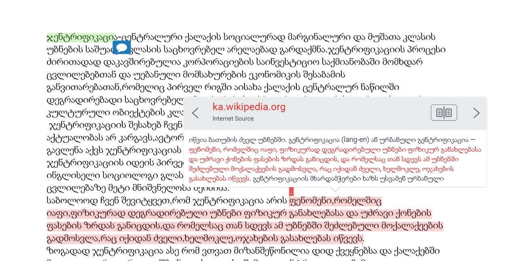
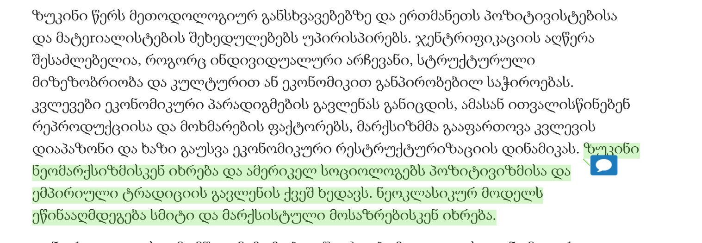
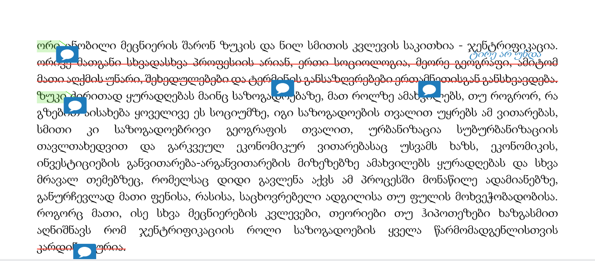

სმკმ: მეშვიდე შეხვედრა

სოციალურ მეცნიერებათა კვლევის მეთოდები
========================================================
author: დავით სიჭინავა
date: 16 აპრილი, 2020 წ.
autosize: true
transition: none
css: css/style.css
font-family: 'BPG_upper'
მეშვიდე შეხვედრა

დღევანდელი შეხვედრის გეგმა
========================================================
* ლიტერატურის მიმოხილვის _მიმოხილვა_
* დაკვირვება

ლიტერატურის მიმოხილვის _მიმოხილვა_
========================================================

ლიტერატურის მიმოხილვის _მიმოხილვა_
========================================================

ლიტერატურის მიმოხილვის _მიმოხილვა_
========================================================

დაკვირვება
========================================================
ეთნოგრაფია და დაკვირვება

დაკვირვება:
========================================================
* ყოველდღიური საქმიანობა;
* უცხო კულტურის შესწავლა;

დაკვირვება: შესასწავლი ერთეული
========================================================
* ადგილი;
* ადამიანები;
* მოქმედება ან საქმიანობა;
* ნივთები;

დაკვირვება: მკვლევრის მონაწილეობა
========================================================
* ჩართული დაკვირვება;
	+ გამჟღავნებული;
	+ გაუმჟღავნებელი;
* ჩაურთველი დაკვირვება;

დახურულ ჯგუფებზე ხელმისაწვდომობა
========================================================
* კონტაქტების მოძიება
* ,,საფასური''
* მიზნების ახსნა
* ,,მოლაპარაკება''

გაუმჟღავნებელი დაკვირვება: დადებითი მხარეები
========================================================
* ხელმისაწვდომობა
* მონაწილეთა სავარაუოდო რეაქცია

გაუმჟღავნებელი დაკვირვება: უარყოფითი მხარეები
========================================================
* ჩანაწერების გაკეთება
* რთულია სხვა მეთოდების გამოყენება
* შფოთვა
* ეთიკური პრობლემები

ჩართული დაკვირვების ტიპოლოგია
========================================================
* აღწერითი დაკვირვება;
* ფოკუსირებული დაკვირვება;
* შერჩევითი დაკვირვება;

მაგალითი: Schuet, 2013

დამატებითი ინფორმაცია:
========================================================
* ინტერვიუირება;
* მეორადი მონაცემების შეგროვება;

მონაცემები:
========================================================
* საველე ჩანაწერები
* ფოტო-ვიდეო-აუდიო ფიქსაცია

მონაცემები:
========================================================

მონაცემები: საველე ჩანაწერები
========================================================
* ენა
	+ საყოფაცხოვრებო
	+ მეცნიერული
	+ ჟარგონი, ,,არგო''
* სიხშირე
	+ ყოველდღიური
* რეფლექსია საკუთარ გამოცდილებაზე

რა უნდა გაითვალისწინოს მკვლევარმა?
========================================================
* ინფორმანტების შერჩვა;
	+ ე.წ. gatekeeper
	+ საკვანძო ინფორმანტი
* მკვლევარი არამარტო მონაწილეა, არამედ მიზანმიმართული _დამკვირვებელია_;
* მკვლევარმა ისეთი დეტალები უნდა დაიმახსოვროს, რასაც საყოფაცხოვრებო პირობებში, ყურადღებას არ მიაქცევდა;
* მოვლენათა ფართო სპექტრი მოიცვა;
* მოვლენებზე ,,უცხო თვალით'' დაკვირვება;
* მკვლევარი თავადაა კვლევის ინსტრუმენტი;
* ყველაფერი დაწვრილებით უნდა იქნას ჩაწერილი;

დავალება: ფოკუსჯგუფის სადისკუსიო გეგმა
========================================================

