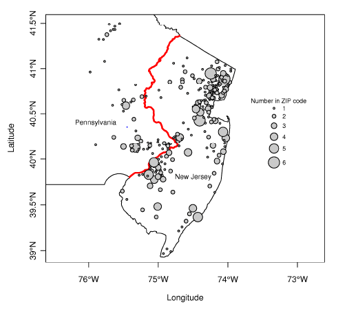

სმკმ: მერვე შეხვედრა

სოციალურ მეცნიერებათა კვლევის მეთოდები
========================================================
author: დავით სიჭინავა
date: 23 აპრილი, 2020 წ.
autosize: true
transition: none
css: css/style.css
font-family: 'BPG_upper'
მერვე შეხვედრა

დღევანდელი შეხვედრის გეგმა
========================================================

- ლექცია:
	+ მიზეზშედეგობრიობა
	+ (კვაზი)ექსპერიმენტული დიზაინი

მიზეზშედეგობრიობა
========================================================

მიზეზშედეგობრიობა
========================================================

Bertrand & Mullainathan (2004)
========================================================
* არსებობს თუ არა რასობრივი დისკრიმინაცია დასაქმების სფეროში?

Bertrand & Mullainathan (2004)
========================================================
| ცვლადი    | აღწერა                                |
|-----------|---------------------------------------|
| firstname | აპლიკანტის სახელი                     |
| sex       | სქესი                                 |
| race      | რასა                                  |
| call      | შეეხმიანენ თუ არა აპლიკანტს ტელეფონზე |

Bertrand & Mullainathan (2004)
========================================================

კაუზალური (მიზეზშედეგობრივი) კავშირი: არისტოტელე
========================================================
* ნივთიერი მიზეზი: მაგ. _ბრინჯაოს_ ქანდაკება
* ფორმის მიზეზი: მაგ. ქანდაკების _ფორმა_
* ცვლილების მიზეზი: მაგ. ხელოვანი და ბრინჯაოს ქანდაკება
* საბოლოო მიზეზი: მაგ. ჯანმრთელობა ფეხით სეირნობის, ვარჯიშის, მედიკამენტების შედეგია

კაუზალური (მიზეზშედეგობრივი) კავშირი: ჰიუმი
========================================================
> იმისთვის, რათა მიზეზშედეგობრიობაზე ვიმსჯელოთ, საჭიროა _სამი_ ემპირიული (დაკვირვებადი) პირობა:
	+ მიზეზი და შედეგი სივრცესა და დროში მიმდებარედ უნდა არსებობდნენ,
	+ მიზეზი შედეგს დროში უნდა უსწრებდეს
	+ მიზეზსა და შედეგს შორის უნდა იყოს _მუდმივი კავშირი_ (ან - ერთნაირად უნდა იცვლებოდნენ)
	
კაუზალური (მიზეზშედეგობრივი) კავშირი
========================================================

კაუზალური (მიზეზშედეგობრივი) კავშირის მოდელები
========================================================
* პოტენციური შედეგების (ე.წ. ნეიმან-რუბინის) მოდელი
* აციკლური ორიენტირებული გრაფები
* სტრუქტურულ განტოლებათა მოდელები

კაუზალური (მიზეზშედეგობრივი) კავშირი
========================================================
* კოვარიაცია
* ყალბი მიმართების შემცირება
* მოვლენათა დროში თანმიმდევრობის დადგენა

შემთხვევითი განაწილების (რანდომიზაციის) როლი
========================================================
* ჰომოგენური ჯგუფების შექმნა - განსხვავება მხოლოდ ექსპერიმენტულ პირობას შეიძლება, დავაბრალოთ
* შერჩევის შეცდომა (Selection bias)
* დიდ რიცხვთა კანონი

ჰიპოთეტური ფაქტები
========================================================

ჰიპოთეტური ფაქტები
========================================================
* ჰიპოთეტური ფაქტები (კონტრფაქტები)
	+ რა მოხდებოდა, რომ...

ნეიმან-რუბინ-ჰოლანდის მიზეზშედეგობრივი სტატისტიკური დასკვნის მოდელი
========================================================

- ყოველი $i$-თვის, $T{i}$ ექსპერიმენტის მიზეზედეგობრივი ეფექტი განიმარტება, როგორც $Y_{i}(1) - Y_{i}(0)$, სადაც $Y_{i}(1)$ წარმოადგენს შედეგს, რომელსაც ექსპერიმენტულ ჯგუფში მივიღებდით, ხოლო $Y_{i}(0)$ - შედეგს, რომელიც საკონტროლო ჯგუფში გვექნებოდა
- მიზეზშედეგობრივი სტატისტიკური დასკვნის ფუნდამენტური პრობლემა

ჰიპოთეტური ფაქტები
========================================================
>> მიზეზშედეგობრივი სტატისტიკური დასკვნის მიზანი ჰიპოთეტური ფაქტების პროგნოზია

კვლევის დიზაინი
========================================================
* შედარება
* მანიპულაცია
* კონტროლი
* განზოგადება

კონტროლი
========================================================
* შიდა ვალიდობა
* გათანაბრება
* რანდომიზაცია
* საკონტროლო ჯგუფი

განზოგადება
========================================================
* გარე ვალიდობა
* რეპრეზენტატულობა
* წინააღმდეგობრივი პირობები

კლასიკური ექსპერიმენტული დიზაინი
========================================================

კლასიკური ექსპერიმენტული დიზაინი
========================================================
* ექსპერიმენტული და საკონტროლო ჯგუფი
* ტესტამდელი (პრეტესტული) და ტესტის შემდგომი (პოსტტესტური) გაზომვა
* ცდისპირთა _შემთხვევითი_ განაწილება

რანდომიზებული კონტროლირებული ექსპერიმენტები
========================================================
| შემთხვევათა რ-ნობა                  | პროპორცია | სტანდარტული შეცდომა |           |
|-------------------------------------|-----------|---------------------|-----------|
| კონტროლი                            | 55        | 0.3353659           | 0.0369792 |
| პირდაპირი წესით არჩეული პრეზიდენტი  | 58        | 0.3536585           | 0.0374481 |
| პარლამენტის მიერ არჩეული პრეზიდენტი | 51        | 0.3109756           | 0.0362566 |
| სულ                                 | 164       |                     |           |

რანდომიზებული კონტროლირებული ექსპერიმენტები
========================================================
| ჯგუფი (საყრდენი: საკონტროლო ჯგუფი) |                                     |           |                |
|------------------------------------|-------------------------------------|-----------|----------------|
|                                    | პირდაპირი წესით არჩეული პრეზიდენტი  | -1.363636 | -9.975612      |
|                                    | პარლამენტის მიერ არჩეული პრეზიდენტი | -21.27273 | (10.24279)**   |
| მემარჯვენე-მემარცხენე სპექტრი      |                                     | 1.818182  | (0.6586654)*** |
| პოლიტიკური ცოდნა                   |                                     | -10.36364 | -10.85779      |
| თავისუფალი წევრი                   |                                     | 2         | -38.20426      |
|                                    |                                     |           |                |
| ფსევდო R2                          |                                     | 0.0901    |                |
| დაკვირვებათა რ-ნობა                |                                     | 157       |                |

რანდომიზებული კონტროლირებული ექსპერიმენტები
========================================================

ფაქტორული დიზაინი
========================================================
* ორი ან მეტი _დამოუკიდებელი ცვლადი_

ფაქტორული დიზაინი
========================================================

რანდომიზაცია?
========================================================
* ჯგუფთაშორისი დიზაინი
* კვაზიექსპერიმენტული დიზაინი

ჯგუფთაშორისი დიზაინი
========================================================
* ორ ან მეტ ჯგუფს შორის განსხვავების შესწავლა

კვაზიექსპერიმენტული დიზაინი
========================================================
* კონტრასტული ჯგუფების დიზაინი
* დაგეგმილი ვარიაციის დიზაინი
* პანელი
* დროთა სერიის (დროის მწკრივების) დიზაინი
* კონტროლის სერიის დიზაინი
* სინთეტური კონტროლის დიზაინი

კვაზიექსპერიმენტული დიზაინი: Abadie, Diamond & Hainmueller, 2010
========================================================
* კალიფორნიის ,,კანონპროექტი-99''
* საკანონმდებლო რეგულაციის გავლენა სიგარეტის გაყიდვებზე

კვაზიექსპერიმენტული დიზაინი: Abadie, Diamond & Hainmueller, 2010
========================================================

ბუნებრივი ექსპერიმენტი: Card & Krueger (1994)
========================================================
* მინიმალური ხელფასის ცვლილება
* იმოქმედა თუ არა ხელფასის მომატებამ დასაქმებაზე?

ბუნებრივი ექსპერიმენტი: Card & Krueger (1994)
========================================================

საველე ექსპერიმენტი: Gerber, Green & Larimer (2008)
========================================================
* იწვევს თუ არა სოციალური ზეგავლენა საარჩევნო აქტივობას?
	+ Shame or Frame?

საველე ექსპერიმენტი: Gerber, Green & Larimer (2008)
========================================================

საველე ექსპერიმენტი: Gerber, Green & Larimer (2008)
========================================================

========================================================

